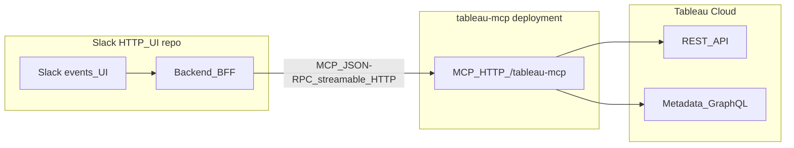

# Handoff: Integrating the Slack HTTP/UI app with **tableau-mcp**

This document is for engineers (or Claude Code) working in the **Slack HTTP/UI repository**. It describes how that app should call the **Tableau MCP server** ([`tableau-mcp`](https://github.com/tableau/tableau-mcp)) so Slack users can run Tableau admin and operations workflows without reimplementing Tableau REST/Metadata logic.

---

## 1. What tableau-mcp is

- A **Model Context Protocol (MCP)** server implemented in **Node/TypeScript**.
- It exposes **tools** (not arbitrary HTTP REST) that wrap **Tableau REST API** and **Metadata API (GraphQL)**.
- Two transports:
  - **`stdio`** — typical for desktop MCP hosts (Cursor, Claude Desktop).
  - **`http`** — **Streamable HTTP** MCP transport on a path like **`/tableau-mcp`** — this is what a **deployed Slack backend** should use.

Your Slack app’s **server** (Bolt, Next.js API routes, etc.) should act as an **MCP client** over HTTP, or call a small **BFF** that does.

---

## 2. Recommended architecture



**Principles**

1. **Do not** put Tableau secrets or PATs in the Slack client. All MCP calls originate from **your backend**.
2. **Per-user Tableau identity**: the MCP server can sign into Tableau as different users when using **direct-trust + JWT** and a **per-request HTTP header** (see §4.2).
3. **Scope tools** for Slack: use `INCLUDE_TOOLS`, `EXCLUDE_TOOLS`, or group filters (`INCLUDE_TOOL_GROUPS` / `EXCLUDE_TOOL_GROUPS`) on the MCP server so Slack only exposes safe operations.

---

## 3. MCP HTTP endpoint

- **URL pattern**: `https://<mcp-host>/<serverName>` where `serverName` is `tableau-mcp` (see [`src/server.ts`](../../src/server.ts) `serverName`).
- **Example**: `https://your-railway-app.example/tableau-mcp`
- **Protocol**: MCP **Streamable HTTP** — JSON-RPC messages over `POST` (and related MCP streaming semantics). Use an MCP client library that supports this transport, or follow the same request sequence as the MCP spec / Inspector.

**Official docs in this repo**

- [HTTP Server configuration](../docs/configuration/mcp-config/http-server.md) (Docusaurus path may vary if you browse the site; in-repo: `docs/docs/configuration/mcp-config/http-server.md`).
- [Dynamic user / per-request Tableau username](../docs/developers/dynamic-user-mcp-handoff.md) — critical for mapping **Slack user → Tableau user**.

---

## 4. Authentication (choose one pattern)

### 4.1 MCP protected with OAuth (default for `TRANSPORT=http`)

- Tableau MCP can require **OAuth** at the HTTP layer (see `OAUTH_*` env vars).
- Your Slack backend completes OAuth as an MCP client and obtains tokens for MCP calls.
- Good when one service account–style session is acceptable; **per-Slack-user Tableau** still needs extra design (tokens per user or proxy).

### 4.2 Direct-trust + header per Slack user (common for internal tools)

When the MCP server is configured with:

- `TRANSPORT=http`
- `DANGEROUSLY_DISABLE_OAUTH=true` (you accept network/proxy hardening)
- `AUTH=direct-trust` + Connected App env vars
- `JWT_SUB_CLAIM={OAUTH_USERNAME}`
- `JWT_SUB_CLAIM_HEADER` = e.g. `X-Tableau-Jwt-Username`

…then **every** MCP HTTP request that should run as a given Tableau user **must** include that header:

| Header | Value |
|--------|--------|
| `X-Tableau-Jwt-Username` | Tableau username / email for the Slack user (from your IdP or profile mapping) |

**Security**: Anyone who can hit the MCP URL can impersonate any username unless you **restrict network access** (VPN, private link, mTLS, or a gateway that injects the header after Slack auth).

Details: [`docs/docs/developers/dynamic-user-mcp-handoff.md`](../docs/developers/dynamic-user-mcp-handoff.md).

### 4.3 Tableau token scopes (Connected App / UAT)

The MCP server requests JWT scopes per tool call (e.g. `tableau:permissions:read`, `tableau:jobs:read`, `tableau:content:read`). Your **Connected App** (or UAT) must allow the scopes needed for the tools you enable for Slack.

---

## 5. Tool catalog (for product + Claude Code)

Tools are registered in [`src/tools/toolName.ts`](../../src/tools/toolName.ts).

| Tool name | Group | Purpose (summary) |
|-----------|--------|-------------------|
| `admin-users` | `admin` | Site users: list, query, add, remove, update, CSV import/delete, credentials. |
| `admin-groups` | `admin` | Groups / group sets and membership. |
| `content-permissions` | `operations` | Tableau permissions REST: granular + default + replace (Ask Data / lens endpoints **not** exposed). |
| `site-jobs` | `operations` | `query-jobs`, `query-job`, `cancel-job` (cancel is **PUT** per Tableau). |
| `tableau-operations` | `operations` | Composite Cloud-safe flows: job overlap + optional Metadata enrichment, live “long job” heuristics, bulk cancel (`dryRun` defaults true), effective Read permission estimate, access trace, content override scan, stale workbook report, lineage GraphQL, archive (.twbx base64 or **S3** if `TABLEAU_ARCHIVE_*` set on MCP server). |

**Restricting tools on the MCP server** (so Slack cannot invoke dangerous ops):

- Env: `INCLUDE_TOOLS` (comma list) or `EXCLUDE_TOOLS`, or `INCLUDE_TOOL_GROUPS` / `EXCLUDE_TOOL_GROUPS` (see [`src/overridableConfig.ts`](../../src/overridableConfig.ts)).

---

## 6. Calling tools from the Slack repo (implementation sketch)

You are **not** calling Tableau URLs directly; you send MCP **`tools/call`** (or equivalent in your SDK) with:

- `name`: one of the tool names above
- `arguments`: JSON object matching that tool’s schema (Zod shapes live under `src/tools/**`).

**Example shape** (illustrative — verify against current Zod schemas):

```json
{
  "name": "site-jobs",
  "arguments": {
    "operation": "query-jobs",
    "filter": "jobType:eq:refresh_extracts",
    "pageSize": 100,
    "pageNumber": 1
  }
}
```

```json
{
  "name": "content-permissions",
  "arguments": {
    "operation": "list-granular-permissions",
    "granularKind": "workbook",
    "resourceId": "<workbook-luid>"
  }
}
```

```json
{
  "name": "tableau-operations",
  "arguments": {
    "operation": "get-stale-content-report",
    "staleDays": 365
  }
}
```

**Slack-specific wiring**

1. On **slash command** or **message**, resolve `slackUserId` → internal profile → **Tableau username string**.
2. Backend opens MCP session (or stateless POST sequence) to `https://<mcp>/tableau-mcp` with **Authorization / OAuth** as required **and** `X-Tableau-Jwt-Username: <tableau username>` if using §4.2.
3. Map natural language or button actions to **tool name + arguments** (your NL layer or fixed menus).
4. Return MCP **text / structured content** to Slack (truncate for `chat.postMessage` limits; link to a detail page for large JSON).

---

## 7. MCP server env vars relevant to Slack integration

| Variable | Why it matters for Slack |
|----------|---------------------------|
| `TRANSPORT=http` | Required for remote BFF. |
| `SERVER`, `SITE_NAME`, `AUTH`, secrets | Tableau sign-in from MCP. |
| `JWT_SUB_CLAIM_HEADER` + `JWT_SUB_CLAIM={OAUTH_USERNAME}` | Per-Slack-user Tableau (with §4.2). |
| `CORS_ORIGIN_CONFIG` | If a browser UI talks to MCP directly (usually avoid; prefer server-to-server). |
| `INCLUDE_TOOLS` / `EXCLUDE_TOOL_GROUPS` | Limit blast radius for Slack users. |
| `TABLEAU_OPS_*`, `TABLEAU_ARCHIVE_*` | Defaults for `tableau-operations` (see [`src/config.ts`](../../src/config.ts)). |

---

## 8. Operational notes

- **PAT + HTTP + many concurrent Slack users**: avoid; PAT sessions conflict. Prefer **Connected App direct-trust** or **UAT** per Tableau guidance in [http-server.md](../docs/configuration/mcp-config/http-server.md).
- **Large responses**: permission and user lists can be huge — page in Tableau via tool args where supported, or summarize in the Slack layer.
- **`archive-workbook`**: may return S3 metadata (when configured on MCP) or base64 for small `.twbx` files — do not post base64 into public channels.

---

## 9. Checklist for the Slack HTTP/UI PR

- [ ] Backend-only MCP client; no Tableau secrets in Slack client bundles.
- [ ] Stable mapping Slack user → Tableau username; header or token strategy documented.
- [ ] MCP base URL + OAuth or network controls documented in runbooks.
- [ ] Tool allowlist aligned with security review (`INCLUDE_TOOLS` / groups).
- [ ] Error handling for Tableau 403/404 surfaced as user-safe Slack messages.
- [ ] Rate limits / timeouts for long `get-effective-permissions` (iterates site users).

---

## 10. Source of truth in tableau-mcp

| Area | Path |
|------|------|
| Tool names / groups | `src/tools/toolName.ts` |
| Tool factories | `src/tools/tools.ts` |
| HTTP entry | `src/server/express.ts`, `src/index.ts` |
| JWT scopes | `src/restApiInstance.ts` |
| Per-request username header | `src/server/jwtSubClaimHeaderMiddleware.ts` |
| Permissions SDK | `src/sdks/tableau/methods/permissionsMethods.ts` |
| Jobs SDK | `src/sdks/tableau/methods/jobsMethods.ts` |
| Composite ops | `src/tools/operations/tableauOperations.ts` |

---

*Generated for cross-repo handoff. Update tool names and env tables if tableau-mcp changes; this file lives in the tableau-mcp repository under `docs/integrations/`.*
